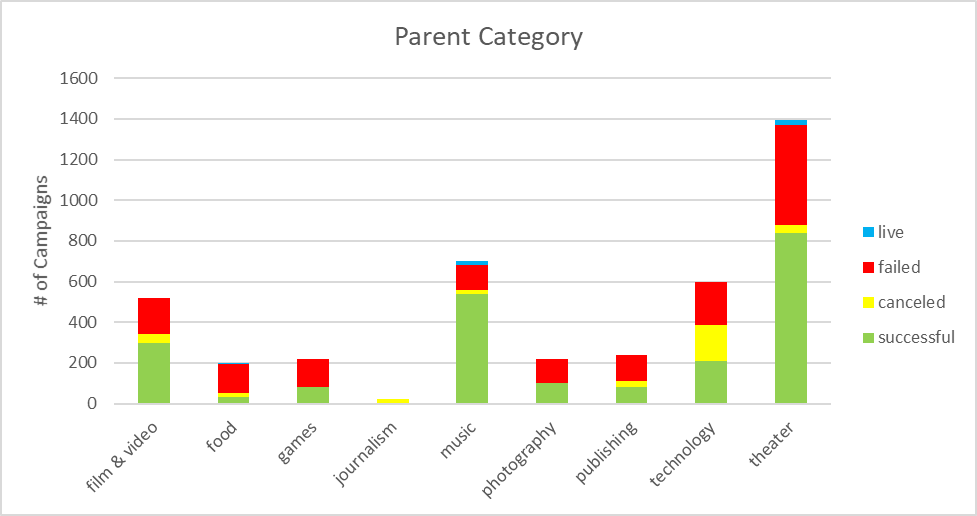
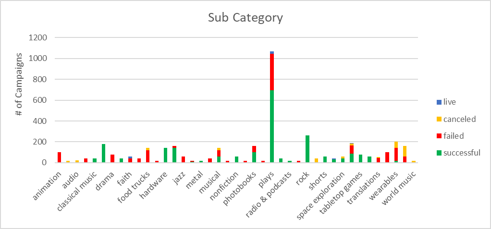
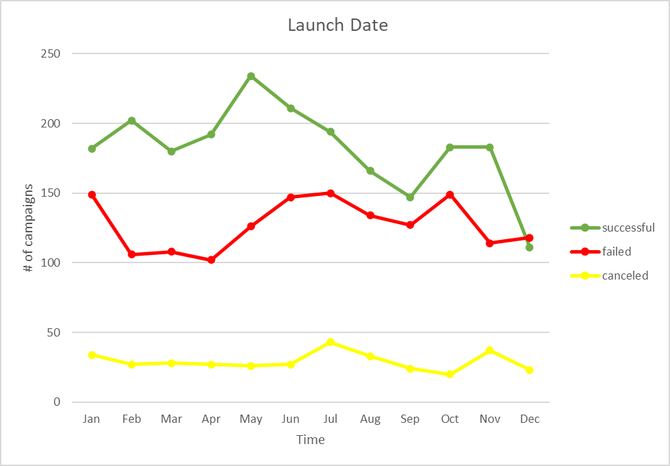
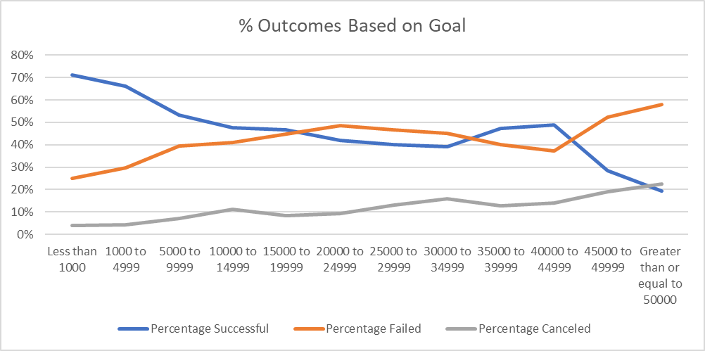
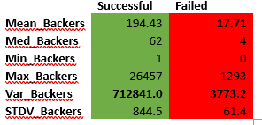

## Background

Over $2 billion has been raised using the massively successful crowdfunding service, Kickstarter, but not every project has found success. Of the more than 300,000 projects launched on Kickstarter, only a third have made it through the funding process with a positive outcome.

Getting funded on Kickstarter requires meeting or exceeding the project's initial goal, so many organizations spend months looking through past projects in an attempt to discover some trick for finding success. 4,000 past projects have been organized and analyzed in order to uncover any hidden trends.

## Analysis

  Based off of the charts derived from the raw Kickstarter data, we can make several observations about the effectiveness of the campaigns and what methods can typically lead to achieving the monetary goal. Three main assumptions we can draw from these visualizations.

  

  Music and Theater tend to have the highest success rate while Food, Games and Publishing tend to do rather poorly.

  

  Within the sub categories, like music for example, we can see that certain campaigns like rock can bring the total amount of success up within their parent category, while others like Jazz bring it the category down (both with 100% success and 100% fail respectively).

  

  The date the campaign started can be a factor of outcome. The months of February and November hold a high amount of success relative to fail while failures rise between June to July as successful campaigns decrease. This might be attributed to the fact that more people are online during the winter months so the campaigns are more visible as more people are inside on their computers. We might also assume that people have less money in December leading up to Christmas, but more money in May after they receive their tax refunds.
  From the data provided we could also derive the amount of time the accounts were live as well as their country location compared to the outcome. Comparing the Percent Funded data against the amount of time the campaign was live could give insight on whether or not campaigns should run longer in general. Having more data about how much each donor contributed would help determine the variance of donations and efficacy of each campaign as well. Provided the data, we could also compare the success of the campaign to the success of the actual business after it raised the necessary funds to launch, in perspective to its success/fail status. Knowing the variance derived from the amount of money from each donation and the amount of post campaign success could yield another metric of community support for the project.
  
  

  The chart above shows that, generally, as the campaign goal increases, the success of the campaign decreases. There is a spike in successful campaigns between the $35,000 and $45,000 range, but further analysis of success rates from each category over time would need to be done in order to draw a further conclusion about the data. 

  

  Since the standard deviation for both data sets is so high, the median is the best way to summarize this information. The data better describes the failed outcomes than the successful based off of the amount of backers because the variance is much higher in the successful backers count as apposed to the failed. The outcome of the campaign is not determined by the amount of backers but the whether or not the campaign was able to reach its goal. For example, one backer could donate the entire goal, however, the more backers typically leads to higher success so the range of data is much more skewed in with the successful outcomes than with the failed.

cameronfarquhar@gmail.com

https://www.linkedin.com/in/cameron-farquhar-10a57855/